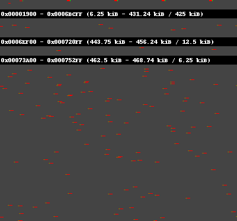

# bitplot - bit pattern visualizer

bitplot is a utility to generate a PNG image file from `cmp -l` output (and more), originally written to visualize a raw NAND ROM bit-rot pattern. (bits are tend to flip from one to zero over time)


## Simple Example

```
$ cmp -l BINARY.orig BINARY.modified > bindiff.txt
$ ./mkbitmap bindiff.txt sample.png
     or
$ cmp -l binary-file.orig BINARY_FILE.modified | ./mkbitmap - sample.png
```
will produce an image like this:



One pixel represents a byte (an octet), and color-coded how different it is from its original file in a way bit-rot stands out. (all bits of a byte is flipped from 1 to 0 is signifiant)


## Input

Diff file (one data per line). You can use 'cmp -l' output as-is or any numeric triplets, one per line. (offset, original-octet, diff-octet)

```
 12345    0  255
 12345    0  255
```

The command accepts hex number.
```
 0x1234ABCD 0x00 0xFF
 0x1234ABCD 0x00 0xFF
```


## Using Plot file with `-p` option

Rather than using a `cmp -l` output, you can write your own script to parse/convert it to a 'plot' file with lines of "(address, color-code)" pair to visualize more complex analysis of (diff of) binary files.

```
# this is comment
# Hex_addr  color_24bit  after second (sets of) space are comments
0x1234ABCD       #0F0  // 0x1234ABCD to green
0x12345678ABCDEF #FFF  // 0x12345678ABCDEF to white
```


## Using `--data` option to plot an original binary file the same range.

With `--data` option, like `mkbitmap -d vim bindiff.txt out.png`, the command will plot a part of the file content that would be displayed with the below color code.

```
def get_data_color(byte):
    if byte is 0:
        return DATA_COLOR_ZERO
    elif byte is 0xFF:
        return DATA_COLOR_EFEF
    return "#0%02X" % byte
```

In this mode, `0x00` and `0xFF` is significant, because for these data, any possible bit flip is oneway (zero to one) or the other (one to zero), so that what you see how bits is just an artifact of original data.


## REQUIREMENT
   * Python-2.5 (maybe work with 2.4)
   * Python Image Library(PIL)
     http://www.pythonware.com/library/pil/handbook/index.htm

